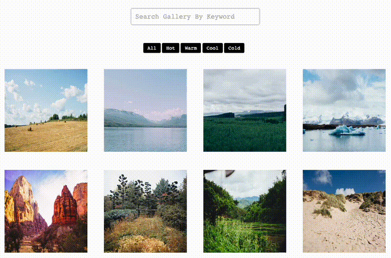

# Photo Gallery Using jQuery Plugins

This was a very early-stage project in the Team Treehouse [Front-End Web Development Tech Degree](https://teamtreehouse.com/techdegree/front-end-web-development) program. I completed the program in 2019. [View my Certificate](https://www.credential.net/1700e85d-d29e-493d-a28e-a8c1860459c8#acc.PS7ITKNb)

The goal of the project was to utilize jQuery plugins to implement functionality. My project uses the [Lightbox2 plugin](https://github.com/lokesh/lightbox2/) for the gallery display. [FilterizR](https://github.com/giotiskl/filterizr/) was used for the searching and sorting.

[View Live Project](https://heidifryzell.com/fetd-project-5/)

## How It's Made:
### Tech Used:
    

## Optimizations

- The placeholder text search box does not have sufficient contrast
- add a way to clear the search query, right now you have manually delete it

## Lessons Learned

This was my first time implementing jQuery plugins to speed development.

I am updating this README a few years after building this project and I have since learned to use node.js. I now would use the node package manager to install the Lightbox2 and FilterizR plugins as dependencies and bypass using jQuery alltogether.

## Recent Projects

Here is my current portfolio:

<table border="1">
  <tr>
    <td style="text-align: center;"><a href="https://heidifryzell.com">heidifryzell.com</a></td>
  </tr>
  <tr>
    <td></td>
  </tr>
</table>
